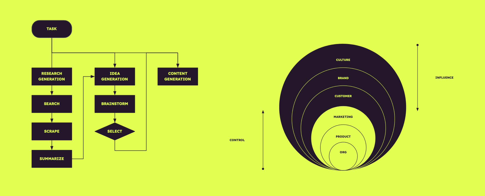

# Communicative Agents for Software Development

<p align="center">
  
</p>


## 📖 Overview

- **Agentcy** is a **virtual creative services company** that operates through various **intelligent agents** holding
  different roles, including Chief Executive Officer, Innovation Director, Marketing Director, etc. These
  agents form a multi-agent organizational structure and are united by a mission to "create desireable futures and outcomes for clients." The agents within Agentcy **collaborate** by participating in specialized functional seminars,
  including tasks such as designing, coding, testing, and documenting.
- The agents are provisioned with a growing list of phases, frameworks and processes to faciliate a deep and wide exploration of problem and solution space.
- Built on the foundations of **ChatDev**

## 📰 News

* **September 1, 2023: TK

## ❓ What Can ChatDev Do?



## ⚡️ Quickstart

Coming soon.


### ChatDev Software Contributors

<a href="https://github.com/qianc62"></a>
<a href="https://github.com/thinkwee"></a>
<a href="https://github.com/NA-Wen"></a>
<a href="https://github.com/lijiahao2022"></a>
<a href="https://github.com/GeekyWizKid"></a>

## 📑 Citation

```
@misc{qian2023communicative,
      title={Communicative Agents for Software Development}, 
      author={Chen Qian and Xin Cong and Wei Liu and Cheng Yang and Weize Chen and Yusheng Su and Yufan Dang and Jiahao Li and Juyuan Xu and Dahai Li and Zhiyuan Liu and Maosong Sun},
      year={2023},
      eprint={2307.07924},
      archivePrefix={arXiv},
      primaryClass={cs.SE}
}
```

## ⚖️ License

- The purpose of ChatDev is exclusively for research purposes.
- The source code is licensed under Apache 2.0.
- The datasets are licensed under CC BY NC 4.0, which allows for non-commercial use only. It is important to note that
  any models trained using these datasets should not be employed for purposes other than research.

## Star History

[](https://star-history.com/#openbmb/chatdev&Date)

## Contact

If you have any questions, feedback, or would like to get in touch, please feel free to reach out to us via email at [chatdev.openbmb@outlook.com](mailto:chatdev.openbmb@outlook.com)
